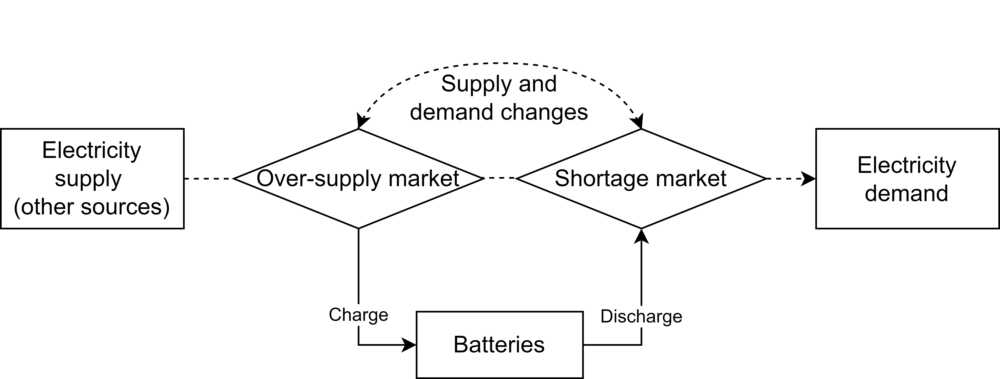
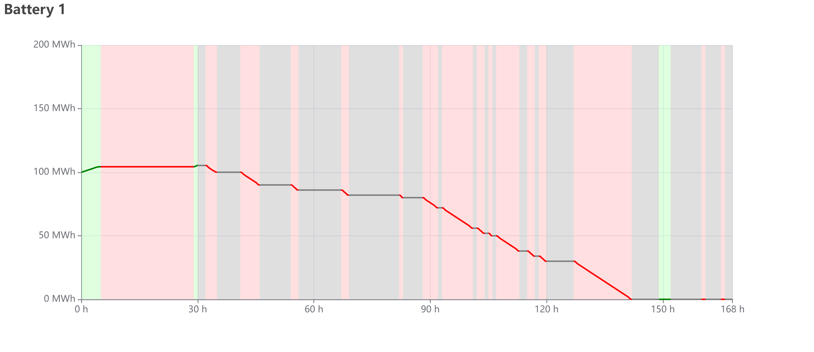
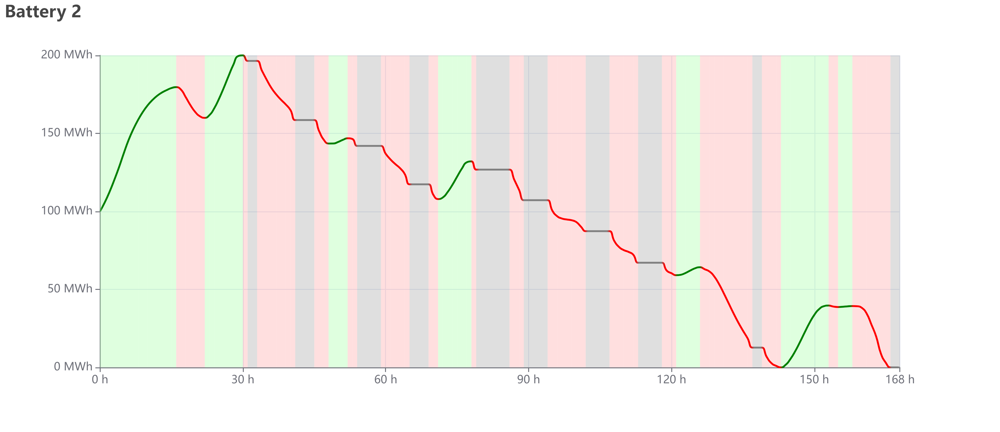
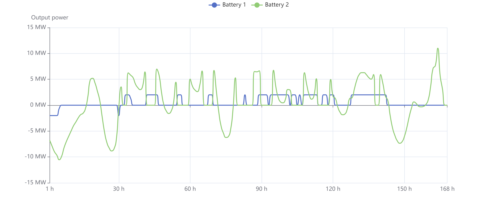
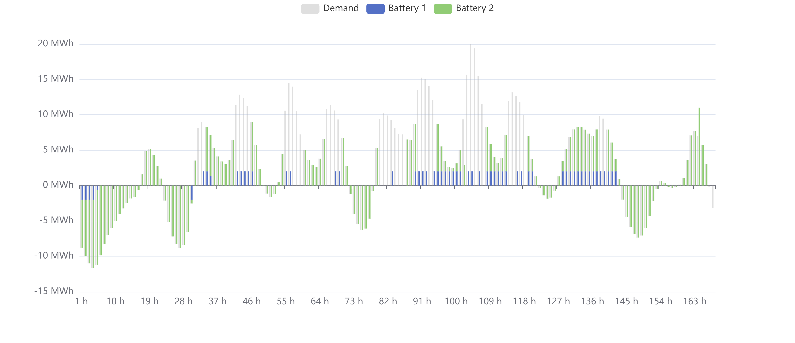

# Battery CD
 Battery charging and discharging planning

## Model definition

### Constants

We have $m$ batteries and intend to serve the electricity market in a time period of $n$ hours.

The electricity demand in each time slot (per hour) is known. Besides the batteries, other sources of power generation in each time slot are known as well. The demand minus all other sources' supply is the amount we need to serve. Denote this amount as $D_{j}, j = 1, ..., n$.

For each battery $i$, we use several arrays of size $1 \times n$ to denote its attributes:

-   The maximum electricity capacity of each battery is $C_{i}$.
-   The charging efficiency is $E_{i}$, the ratio of the amount of electricity added into the battery over the amount of charged electricity.
-   The maximum charging power is $I_{i}$.
-   The maximum discharging power is $O_{i}$.

### Variables

By default, all the variables are non-negative.

Let $t_{j}, \forall j = 1, ..., n$ be unserved amount of electricity in each time slot $j$.

Let $P_{ij}, \forall i = 1, ..., m, \forall j =  1, ..., n$ be discharged amount of electricity of each battery $i$ and each time slot $j$.

Let $H_{ij}, \forall i = 1, ..., m, \forall j =  1, ..., n$ be charged amount of electricity of each battery $i$ and each time slot $j$.

Let $S_{ij}^{c}, \forall i = 1, ..., m, \forall j =  1, ..., n$ be a binary variable to state whether battery $i$ is charging at time slot $j$.

Let $S_{ij}^{d}, \forall i = 1, ..., m, \forall j =  1, ..., n$ be a binary variable to state whether battery $i$ is discharging at time slot $j$.

Let $A_{ij}, \forall i = 1, ..., m, \forall j =  1, ..., n+1$ be the amount of electricity remained in each battery $i$ at the beginning of each time slot $j$.

### The objective function

We penalize the total amount of unserved electricity.

$$
\min{\sum_{j = 1}^{n}t_{j}}
$$

### Constraints

The unserved electricity is lower bounded by the gap between discharging amount and demand. Over-generation is not penalized.

$$
D_{j} - \sum_{i = 1}^{m}P_{ij} \leq t_{j}, \quad \forall j = 1, ..., n
$$

The charging deducts the discharging amount is equal to the difference of remained electricity in the battery between the current and the previous hour.

$$
A_{ij} + E_{i}H_{ij} - P_{ij} = A_{i,j + 1}, \quad \forall i = 1, ..., m, \quad j = 1, ..., n
$$

Specifically, $A_{i,1}, \forall i = 1, ..., m$ is assigned the initial amount of electricity in the battery.

If the battery is not in the charging status, the amount of charging must be 0. If the battery is in the charging status, the amount can be as large as the maximum charging power.

$$
H_{ij} \leq I_{i}S_{ij}^{c}, \quad \forall i = 1, ..., m, \quad j = 1, ..., n
$$

A similar constraint is applied to discharging.

$$
P_{ij} \leq O_{i}S_{ij}^{d}, \quad \forall i = 1, ..., m, \quad j = 1, ..., n
$$

The battery cannot charge and discharge at the same time.

$$
S_{ij}^{c} + S_{ij}^{d} \leq 1, \quad \forall i = 1, ..., m, \quad j = 1, ..., n
$$

If the battery is fully charged, it cannot charge.

$$
A_{ij} \leq C_{i}, \quad \forall i = 1, ..., m, \quad j = 1, ..., n
$$

Similarly, if the battery is empty, it cannot discharge.

$$
P_{ij} \leq A_{ij}, \quad \forall i = 1, ..., m, \quad j = 1, ..., n
$$

If the electricity produced by other sources cannot fulfill the demand, all batteries cannot charge.

$$
\sum_{i = 1}^{m}H_{ij} \leq \max\left( 0, -D_{j} \right), \quad \forall j = 1, ..., n
$$

## Results

Fill in the required parameters and click "Solve", the program will solve this problem and show results in 4 tabs.

In "Solution" tab, it gives the value of all variables. Refer to [Javascript LP solver](https://www.npmjs.com/package/javascript-lp-solver) to understand the meaning of the results. If a variable is not presented, it's value is 0.

*The following figures are only examples to explain how the results look like. The values in the figure are not an optimal solution.*

In "Charging history" tab, it shows the figure of remained energy of each battery. The green line and background means charging; the red means discharging; the grey means idle. If the charging status of the background mismatches the increasing or decreasing value of remained energy, the solution must be not optimal. For example, if the background is red but the remained energy is increasing, there is $S^d>0, A_{i,j} > A_{i,j-1}$ and some constraints are violated. If the background is red but the remained energy is flat, it means $S^d>0$ (allowing discharging) but the battery is idle. Therefore, the result is not optimal as $S^d = 0$ is tighter. 

The maximum value of Y-axis always the energy capacity of battery, therefore the height ratio of curve means the battery level. The X-axis value "1 h" means at the moment of "1:00".

In "Power history" tab, it shows the output and input power of each battery. The positive part of Y-axis is output (discharging) power, and the negative part is input (charging) power. The X-axis value "1 h" means the end of the period "0:00 ~ 1:00".

In "Served electricity" tab, the height of the grey bar is the amount of electricity demand. The positive value means other supply resources cannot fulfill the demand of the electricity market; the negative value means redundant electricity is available in the electricity market and batteries owner can use these energy to charge batteries. The stacked bars of batteries are the amount of energy taken or served in each period. 

The following table explains how to compare the height of bars.

| Stacked height of battery bars \_\_\_\_\_\_ the height of grey bar. | Grey bar is positive.                                        | Grey bar is negative.                                        |
| ------------------------------------------------------------ | ------------------------------------------------------------ | ------------------------------------------------------------ |
| equal to                                                     | All demand are served by the batteries group.                | All redundant energy in the market is used to charge batteries. |
| is shorter than (absolute value in either direction)         | The batteries group cannot fulfill the electricity demand.   | Part of the redundant energy in the market is used to charge batteries, the other part is wasted. |
| is longer than                                               | The batteries group over-serve electricity and the redundant electricity is wasted. | Infeasible.                                                  |

The X-axis value "1 h" means the end of the period "0:00 ~ 1:00".

